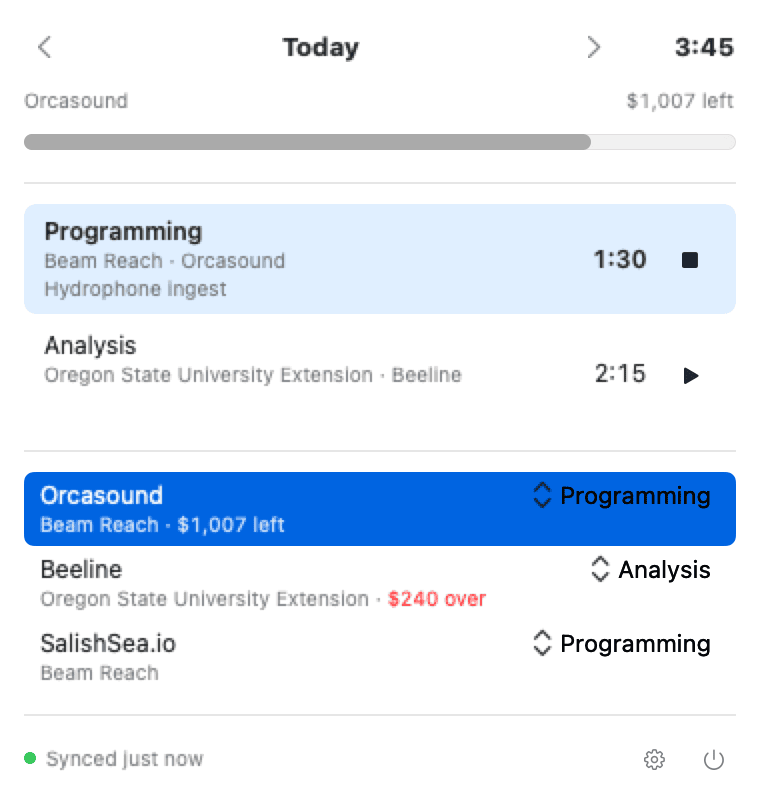
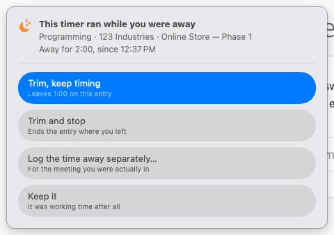

# Sheaves

[](https://github.com/rainhead/sheaves/actions/workflows/build.yml)

A native SwiftUI menu bar client for [Harvest](https://www.getharvest.com) time tracking.

It notices when a timer has been running with nobody at the Mac and offers to trim
the time — and it knows that being on a call is not being away, so it stays quiet
through Zoom and Meet. The clock you are on is always visible in the menu bar,
⌃⌥⌘T starts a timer from anywhere, and nothing blocks on the network: Sheaves shows
local state immediately and reconciles with Harvest afterwards.



## Status

Early. The macOS app tracks time; iOS is not built yet, but everything except the
views lives in a platform-neutral package so it can be.

It was built for one person's use, which is why it does what it does and no more.
**If this is interesting to you, please get in touch** —
[open an issue](https://github.com/rainhead/sheaves/issues) and say hello. If there
is enough interest I will put a build on the App Store for a small fee, so it can be
installed without a checkout and a toolchain.

## Running it

Requires Xcode 26 or later.

```sh
brew install xcodegen     # the .xcodeproj is generated, not committed
xcodegen generate
open Sheaves.xcodeproj
```

The project signs ad-hoc, so a fresh checkout builds and runs with no Apple
Developer account. The catch is that an ad-hoc signature changes with every build,
so macOS treats each rebuild as a different app and re-prompts for the Keychain item
holding your token. To stop that, copy
[`Config/Local.example.xcconfig`](Config/Local.example.xcconfig) to
`Config/Local.xcconfig` (git-ignored) and fill in your team ID. A **free** Apple ID
is enough — the $99 Developer Program is for distribution, not for running your own
app on your own Mac.

Then create a personal access token at
[id.getharvest.com/developers](https://id.getharvest.com/developers) and paste it,
with the account ID shown beside it, into Sheaves' settings. The token is stored in
the Keychain and sent only to `api.harvestapp.com`.

Settings has a switch to open Sheaves at login, which registers the bundle where it
sits right now — move the app and the switch has to go off and on again to point at
the new location.

```sh
swift test --package-path Packages/SheavesCore              # core logic
xcodebuild -project Sheaves.xcodeproj -scheme Sheaves \
  -destination 'platform=macOS' test                        # app logic
```

The core suite is the bulk of it. The app suite exists because the parts that only
compile against AppKit had no tests at all, and that is where the worst bugs turned
up — a shortcut recorder that trapped on every key press, and a missing main menu
that made ⌘V silently do nothing.

## How it works

Three ideas carry most of the design.

**A day is not a moment.** Harvest's `spent_date` is a date with no time zone, and
round-tripping it through `Date` puts entries on the wrong day for anyone east or
west of wherever the conversion happened. [`CalendarDate`](Packages/SheavesCore/Sources/SheavesCore/Model/CalendarDate.swift)
keeps days as days and only becomes a `Date` against an explicit calendar.

**Time is recorded, not re-measured.** Harvest's `/stop` banks time up to the moment
the request *arrives*, and a create starts its timer on arrival too — so replaying
bare commands after a spell offline destroys or invents hours in equal measure. Every
[`Mutation`](Packages/SheavesCore/Sources/SheavesCore/Store/MutationQueue.swift) that
affects elapsed time carries the time the user acted and sends explicit hours, so an
entry is honest however late the request lands.

**Local state is the truth until a sync succeeds.** Every action — start, stop,
resume, edit — changes [`TimeTracker`](Packages/SheavesCore/Sources/SheavesCore/Store/TimeTracker.swift)
first and reaches Harvest second, through a persisted
[`MutationQueue`](Packages/SheavesCore/Sources/SheavesCore/Store/MutationQueue.swift).
The queue drains in order and stops at the first failure a retry could fix, so a
dropped connection costs nothing; a change Harvest refuses outright is dropped rather
than left to wedge everything behind it. An entry started offline has no Harvest id
yet, which is why [`TrackedEntry`](Packages/SheavesCore/Sources/SheavesCore/Model/TrackedEntry.swift)
identity is either a server id or a local one, swapped when the create lands.

**The menu bar is a control, not a readout.** The status item shows a pause button
while a timer runs and a play button for 90 minutes after one stops, so the common
action costs one click and opens nothing; clicking the name opens the popover
instead. That is why [`StatusItemController`](Apps/Mac/Sources/StatusItemController.swift)
is hand-rolled AppKit — SwiftUI's `MenuBarExtra` has exactly one behaviour, which is
to open its content on any click.

**Being on a call is not being away.** Idle detection that watches only the
keyboard and mouse interrupts every meeting to ask whether you are still there, and
Harvest's own app does exactly that. Sheaves counts the microphone being in use as
presence — while you are muted too, which is the case that decides whether any of
this is worth having — so a call is time at work like any other. It asks whether a
device is running, never what it is carrying, so it needs no microphone entitlement
and prompts for no permission. A locked screen outranks it, and an absence only
speaks for a timer that was running while somebody was here: one started on the web
or a phone is left alone, because this Mac knows nothing about it.
[How Sheaves decides you are here](docs/presence.md) has the measurements and the
limits.



**Suggestions are ranked by what you actually do.** Harvest returns every task on
every assigned project, alphabetically, burying the two or three things you do daily.
Sheaves ranks them by 90 days of your own entries, weighted so the score halves every
three weeks: frequency alone pins a finished project to the top for weeks, recency
alone lets one stray entry outrank a habit.

**A budget appears only if there is one.** Harvest's project budget report answers
`budget_by: none` for a project that budgets nothing, and empty figures for a
monetary budget, which only administrators and managers holding the billable-rates
permission may read. On some accounts there is nothing to draw, and there is no
lesser version to fall back on — so
[`BudgetBar`](Apps/Mac/Sources/BudgetBar.swift) is absent rather than present and
empty, and a refusal is taken as a settled answer rather than retried. It is also
the one thing here on Harvest's Reports API, whose allowance is 100 requests per 15
*minutes* rather than per 15 seconds, so budgets refresh on a slow clock of their
own instead of riding every start and stop.

**The UI never waits to draw.** A JSON
[snapshot](Packages/SheavesCore/Sources/SheavesCore/Persistence/SnapshotStore.swift)
of the last known state is restored at launch, so the popover is populated before the
first request returns.

The global hotkey uses Carbon's `RegisterEventHotKey`
([`GlobalHotKey`](Apps/Mac/Sources/GlobalHotKey.swift)) rather than an `NSEvent`
monitor: it needs no Accessibility permission and can actually consume the key. It is
rebindable in Settings, and says so when another app already owns the combination —
Carbon reports that by failing silently, which is worth surfacing.

## Layout

| Path | What lives there |
| --- | --- |
| [`Packages/SheavesCore`](Packages/SheavesCore) | API client, models, store, persistence. No AppKit, no SwiftUI. |
| [`Apps/Mac`](Apps/Mac) | The menu bar app: popover, quick-entry panel, settings. |
| [`project.yml`](project.yml) | Targets and build settings; the `.xcodeproj` is generated from it. |
| [`docs`](docs) | Notes too long for here, and the images this file uses. |

## Keyboard

| | |
| --- | --- |
| ⌃⌥⌘T | Quick entry, from any app (rebindable in Settings) |
| Click ⏸ / ▶ in the menu bar | Pause or resume, without opening anything |
| ↑ ↓ | Move through the day's entries and the projects, as one list |
| ⏎ | Stop or resume the selected entry, or start the selected project |
| ⌘← ⌘→ | Previous / next day |

## Licence

MIT. See [LICENSE](LICENSE).
